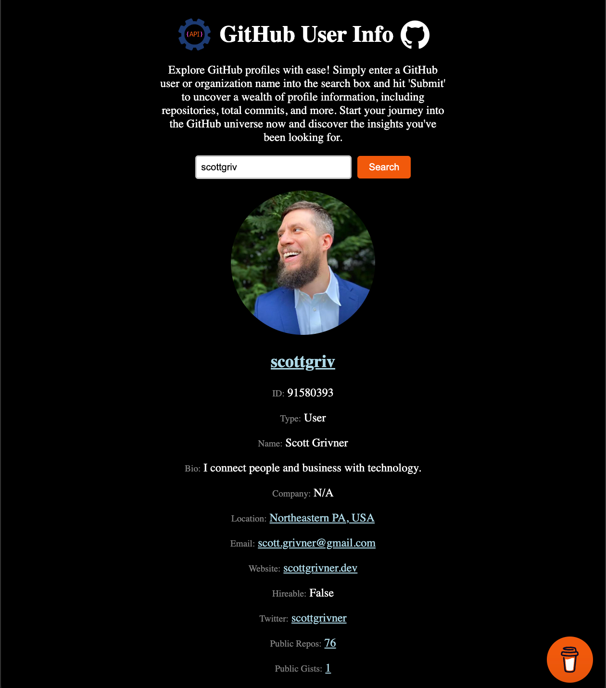

<!-- Begin README -->

    

 

    
    
    
     
    
    
    
     
    

---------------

<h1 align="center">⚙️ GitHub User Info ⚙️</h1>

A web application, utilizing GitHub API, that allows you to search for GitHub user or organization in order to view profile information and other details.
- View a demo of the project on GitHub Pages **[Here](https://scottgriv.github.io/angular-github_user_info/)**.

    
     
    <i>Application Preview</i>

---------------

## Table of Contents

- [Getting Started](#getting-started)
    - [Development server](#development-server)
    - [Code scaffolding](#code-scaffolding)
    - [Build](#build)
    - [Running unit tests](#running-unit-tests)
    - [Running end-to-end tests](#running-end-to-end-tests)
    - [Further help](#further-help)
- [Resources](#resources)
- [License](#license)
- [Credits](#credits)

## Getting Started

### Development server

Run `ng serve` for a dev server. Navigate to `http://localhost:4200/`. The application will automatically reload if you change any of the source files.

### Code scaffolding

Run `ng generate component component-name` to generate a new component. You can also use `ng generate directive|pipe|service|class|guard|interface|enum|module`.

### Build

Run `ng build` to build the dev project, use `ng build --prod` for prod. The build artifacts will be stored in the `dist/` directory.

### Running unit tests

Run `ng test` to execute the unit tests via [Karma](https://karma-runner.github.io).

### Running end-to-end tests

Run `ng e2e` to execute the end-to-end tests via a platform of your choice. To use this command, you need to first add a package that implements end-to-end testing capabilities.

### Further help

To get more help on the Angular CLI use `ng help` or go check out the [Angular CLI Overview and Command Reference](https://angular.io/cli) page.

## Resources

- [GitHub Rate Limits for REST API](https://docs.github.com/en/rest/using-the-rest-api/rate-limits-for-the-rest-api?apiVersion=2022-11-28) - GitHub Rate Limits for REST API explained.
- [Angular](https://angular.io/) - A TypeScript-based open-source web application framework led by the Angular Team at Google and by a community of individuals and corporations.
- [Angular CLI](https://github.com/angular/angular-cli) - A command-line interface tool that you use to initialize, develop, scaffold, and maintain Angular applications.
- [GitHub API](https://docs.github.com/en/rest) - The REST API allows you to fetch data from and interact with GitHub.
- [SASS](https://sass-lang.com/) - A preprocessor scripting language that is interpreted or compiled into Cascading Style Sheets (CSS).
- [TypeScript](https://www.typescriptlang.org/) - A programming language developed and maintained by Microsoft. It is a strict syntactical superset of JavaScript and adds optional static typing to the language.
- [HTML](https://developer.mozilla.org/en-US/docs/Web/HTML) - The standard markup language for documents designed to be displayed in a web browser.
- [CSS](https://developer.mozilla.org/en-US/docs/Web/CSS) - A style sheet language used for describing the presentation of a document written in a markup language such as HTML.

## License

This project is released under the terms of the **MIT License**, which permits use, modification, and distribution of the code, subject to the conditions outlined in the license.
- The [MIT License](https://choosealicense.com/licenses/mit/) provides certain freedoms while preserving rights of attribution to the original creators.
- For more details, see the [LICENSE](LICENSE) file in this repository. in this repository.

## Credits

**Author:** [Scott Grivner](https://github.com/scottgriv)  
**Email:** [scott.grivner@gmail.com](mailto:scott.grivner@gmail.com)  
**Website:** [scottgrivner.dev](https://www.scottgrivner.dev)  
**Reference:** [Main Branch](https://github.com/scottgriv/angular-github_user_info)  

---------------

    

<!-- End README -->